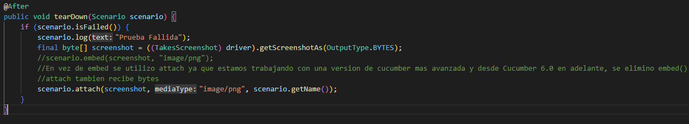

# Prueba-Automatizada-en-Amazon
Pruebas automatizadas en amazon paginación y carrito.
## Elementos fundamentales en el comportamiento de esta prueba automatizada 
IMPORTANTES:
- (build.gradle)contiene dependencias de los repositorios : Selenium WebDriver y Cucumber.
- (AmazonSearchPage.feature)contiene el escenario de aceptación y sus pasos como Given, And y Then.
- (AmazonSearchSteps.java) contiene el orden de ejecución de los steps Given,And y Then con sus funciones.
- (runner.java)contiene funciones y etiquetas para la ejecución de la prueba.
- (hooks.java)contiene funcion que agrega screnshots al reporte.

Mientras tanto, con el archivo extent.properties que contiene una libreria de reportes, al momento de ejecutar una prueba se va generando
una carpeta llamada (test-output) que contiene un html con el reporte de la ejecución reciente.

## Modificaciones o adiciones:
- 1.Dentro del proyecto se agrego una carpeta llamada drivers donde se guardo el driver (chromedriver.exe). 
- 2.En la parte logica del archivo hooks tenemos una funcion que agrega screenshots al reporte este utiliza un metodo llamado embed que recibe la imagen(El screenshot) pero en este caso se utilizo otro metodo llamado attach ya que se trabajo con una version de cucumber avanzada y a partir de cucumber 6.0 en adelante se eliminó embed().

